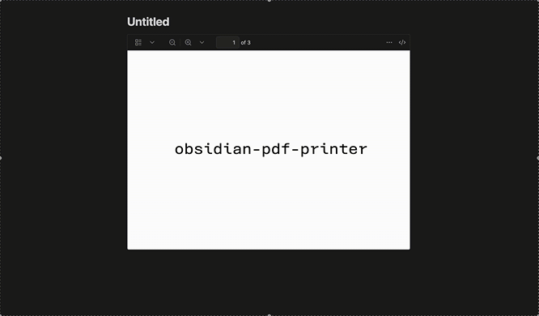

# PDF Printer

PDF Printer is an Obsidian plugin that converts PDF documents in your vault into images, making it easy to embed and annotate PDF content directly in your notes.

## Features

-   Convert PDF documents into WEBP images inside Obsidian
-   Batch conversion of multi-page PDFs
-   Simple command to trigger conversion
-   User-definable image quality

## Installation

1. Copy the project files into your vault's `.obsidian/plugins/pdf-printer/` folder
2. Restart (or reload) Obsidian
3. Enable **PDF Printer** in Settings > Community plugins

## Usage

1. Select a link to a `![[file.pdf]]`
2. Open the Command Palette and run **PDF Printer: Convert PDF to images**
3. Images will be generated, saved in a seperate folder and the PDF link will be replaced with the WEBP image links for the pages

## Configuration

-   **Image quality** can be set from 0 (lowest) to 1 (highest) in the settings. A lower value reduces image quality, but also decreases file size.
-   A folder for **printed images** can be set to better organize your vault.

## Contributing

Contributions are welcome! Please open an issue or submit a pull request on the GitHub repository.

## License

This project is licensed under the MIT License.
